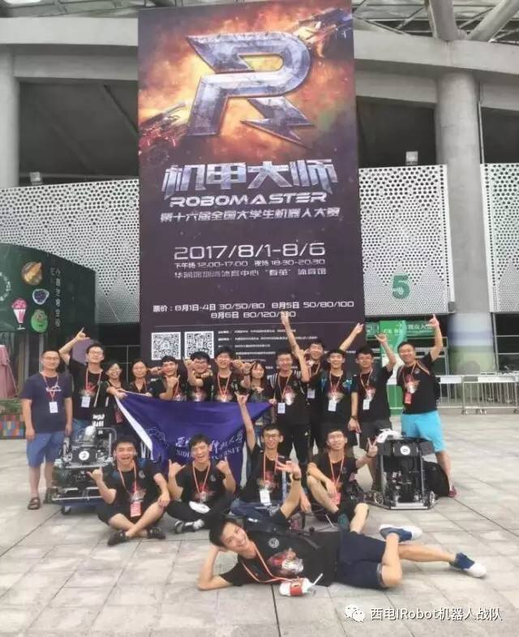

[TOC]

# 为2017Robomaster全国大学生机器人大赛写的打大符机器学习程序
  代码写了两天，包含训练mnist的50000张图片，图像处理，检测白底黑字的九宫格数字；云台与图像的映射，用图像中心->激光点

***
## 依赖
+ Python3.5
+ opencv3.2
+ TensorFlow1.0（可选）

## 设计思路
似乎在工业程序中，POD用的更多。
1. 先处理数据，训练一个svm分类器模型。
2. 载入模型，预处理图像，因为已知图像特征为白底黑字，所以处理就是阈值分割，轮廓提取，归一化，然后用模型计算HOG，输出标签。根据匹配内容，获取框中点。
3. 在黑暗情况下，安放好摄像头和激光，收集激光点在图像中的位置与从下位机获取的云台转轴数据，训练一个（2,2）的回归模型，用来预测转动角度

## 还有什么
+ 代码有些乱，当时写的，后来不想花时间整理优化，能运行就再也没改过
+ 尝试了其它的两种训练方法，包括一开始用TensorFlow1.0的CNN

## 比赛效果
没有上场过，肯定还需要很多辅助程序
### 不更新了
可能在本科期间还是更想广度优先搜索